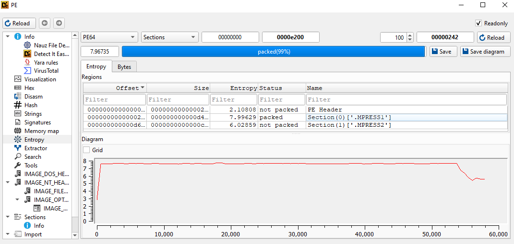
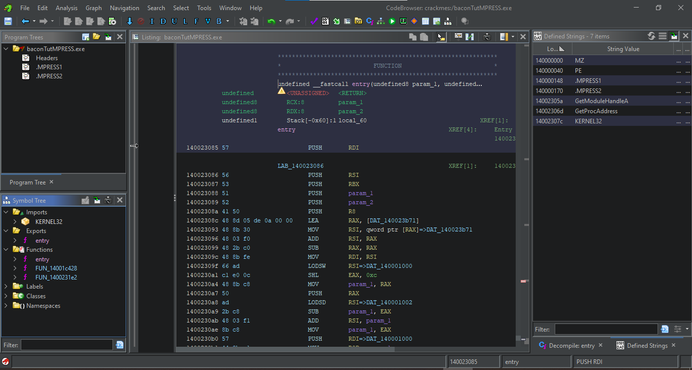
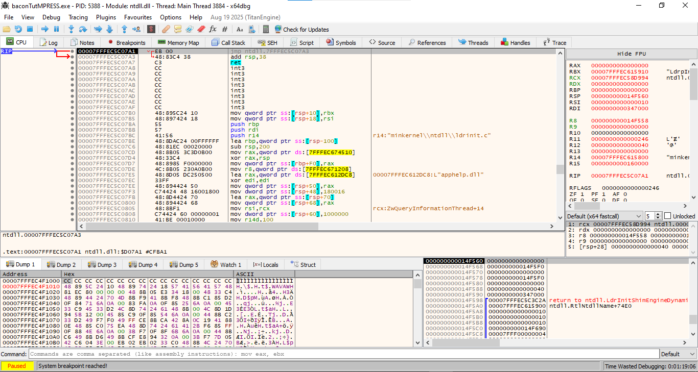
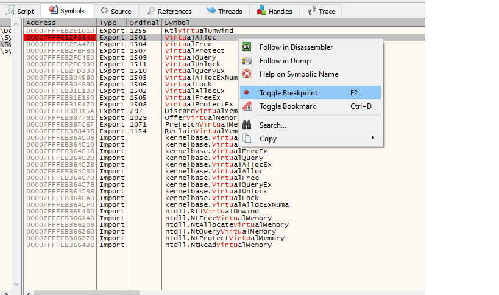
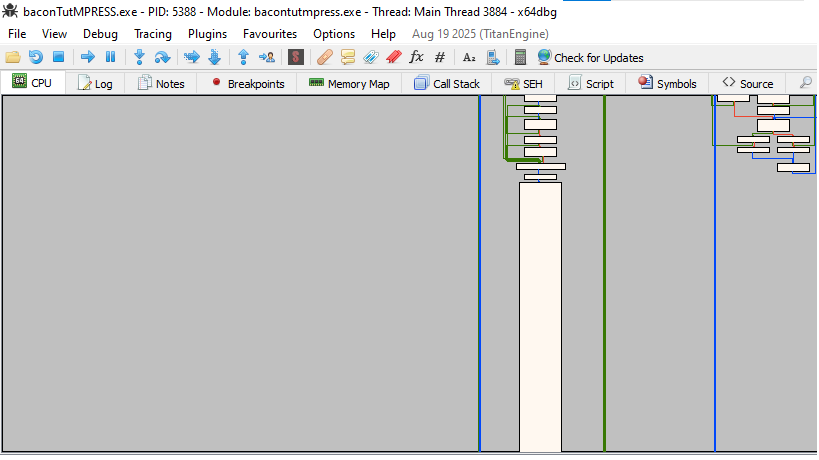
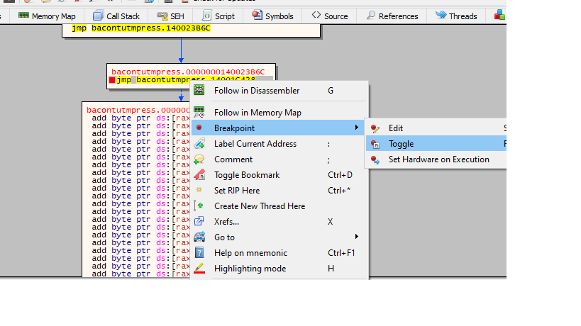
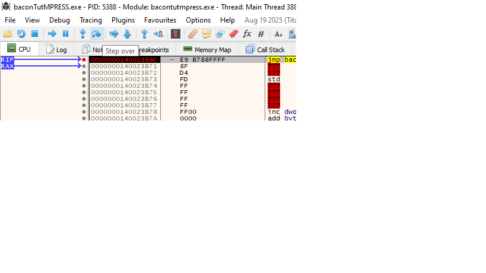
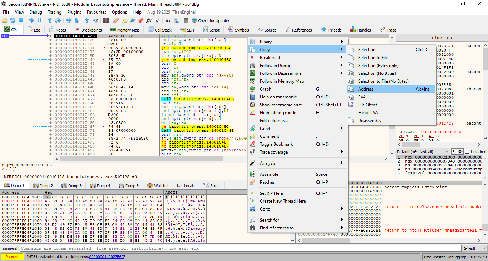
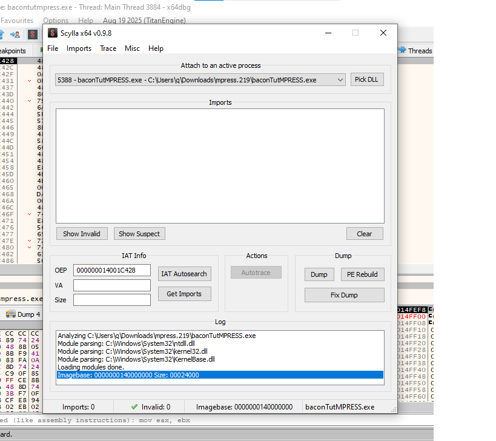
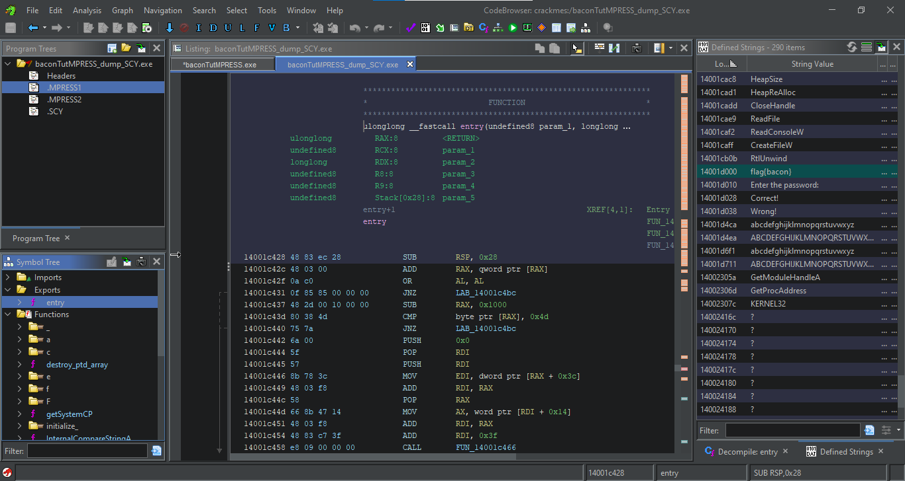

# Manually Unpacking MPRESS Tutorial

In this tutorial, we’ll take a simple C program, pack it with MPRESS, and then manually unpack it using x64dbg, step by step. We could use the same method as the [UPX tutorial](UpxTut.md) but I'm going to use a different one for this one

What is "MPRESS"?

"MPRESS" according to the [official AutoHotkey page](https://www.autohotkey.com/mpress/mpress_web.htm) for the tool, doesn't officially stand for a specific phrase, but it refers to a free, high-performance executable packer that uses in-place decompression to make programs and libraries smaller and decrease load times. It is named simply "MPRESS," which is the name of the tool itself rather than an acronym for longer words

So how do we manually unpack a binary?

In the simplest of terms, we will basically run the packed binary to let the unpacking stub unpack the binary for us and then dump the process to disk and manually fix the PE header. Usually this is done in three simple steps:
1. Find the OEP
2. Fix the IAT
3. Dump the binary from memory to disk

There are various methods of doing this but I will be using a fairly simple one that involves x64dbg and scylla.

## **Setup**

**Tools**
- [x64dbg](https://x64dbg.com/)
- [Ghidra](https://github.com/NationalSecurityAgency/ghidra)
- [DIE](https://github.com/horsicq/Detect-It-Easy)


**Creating a simple program:**
We'll start with a minimal C program that prompts the user for a password and compares it to a hardcoded string `flag{bacon}` This will be our test program for packing and unpacking.

**Source Code:**

```c
#include <stdio.h>
#include <string.h>

int main() 
{
    char input[32];
    const char *flag = "flag{bacon}";

    printf("Enter the password: ");
    gets(input);  
	
    if (strcmp(input, flag) == 0) {
        printf("Correct!\n");
    } else {
        printf("Wrong!\n");
    }

    return 0;
}
```
**Packing with MPRESS:**
Next, after compiling the source above, we will pack the resulting binary with MPRESS


## **Step 0 How to tell if a binary is packed with MPRESS:**
To determine if your binary is packed or not there are some indicators to look out for which will indicate that the binary is packed. The first of which is checking the binary’s entropy.

Entropy is a measure of randomness and the higher the entropy the more random the data is, usually indicating that it is encoded or encrypted. The rule of thumb is that, if the entropy is 6.5 and above this is an indicator that the sample may be packed.

For this step we will open the binary with DIE(Detect It Easy) and check the entropy.

Notice in the image below that the entropy is 7.9 which is about the 6.5 rule of thumb

Now for the other Idicators we will open the binary in Ghidra. Below is a screenshot of the packed binary(bacontutMPRESS.exe) opened in Ghidra. Pay careful attention to the Imports on the left, the listing view in the middle and the Strings on the right. Notice how there are very little Imports and Functions. Next look at the right and see how very little strings there are compared to the unpacked binary.



After considering those indicators we can now determine whether or not the binary is packed and move on to step 1

## **Step 1 Find the OEP:**
Now we will open the packed binary in x64debug. Below is a simple screenshot of what it looks like when you open the binary in x64debug.

Next we will need to look for the OEP. Go to the Symbols tab and put a breakpoint on VirtualAlloc.



Next Click Run

Then go into the graph view and look for a giant block of invalid intructions. If you don't see it try clicking run again and going back into the graph view.



After finding the giant block of code we want to select the jump intruction before it and set a breakpoint. This is called the Tail Jump.



Now we want to hit run and reach our breakpoint

After reaching our breakpoint next press step into



and then copy the address of RIP. Congrats we have found the OEP



## **Step 2 & 3**

Next, we open Scylla from the x64dbg toolbar. Once Scylla is open, paste the RIP address you copied from the breakpoint into the OEP field. This tells Scylla where the Original Entry Point of the unpacked binary is located.

Click “IAT Autosearch” to have Scylla locate the Import Address Table. Once Scylla finds the imports, press “Get imports”. Next press “Dump” to save the unpacked binary to disk. If the original file was named “bacontutMPRESS” the dump will be named “bacontutMPRESS_dump”. Finally, use Scylla’s “Fix Dump” options to ensuring the dumped binary is runnable outside of the debugger. If the original file was named “bacontutMPRESS_dump” the dump will be named “bacontutUPX_dump_MPRESS”.


**Verify in Ghidra**

Open the dumped file (bacontutMPRESS_dump_SCY) in Ghidra. You should now see the following: The Imports are restored. The Functions are recognizable in the listing view. All the Strings are present, including the hardcoded password (flag{bacon}).



This confirms that the binary has been successfully unpacked and can now be analyzed normally. You can now run the binary to test that it behaves as expected or continue reverse engineering it further.

Optional notes for readers
Some binaries may require additional fixes after dumping, depending on how the packer works.
Always keep a backup of the original packed binary in case something goes wrong.

**Manually unpacking MPRESS resource list**


