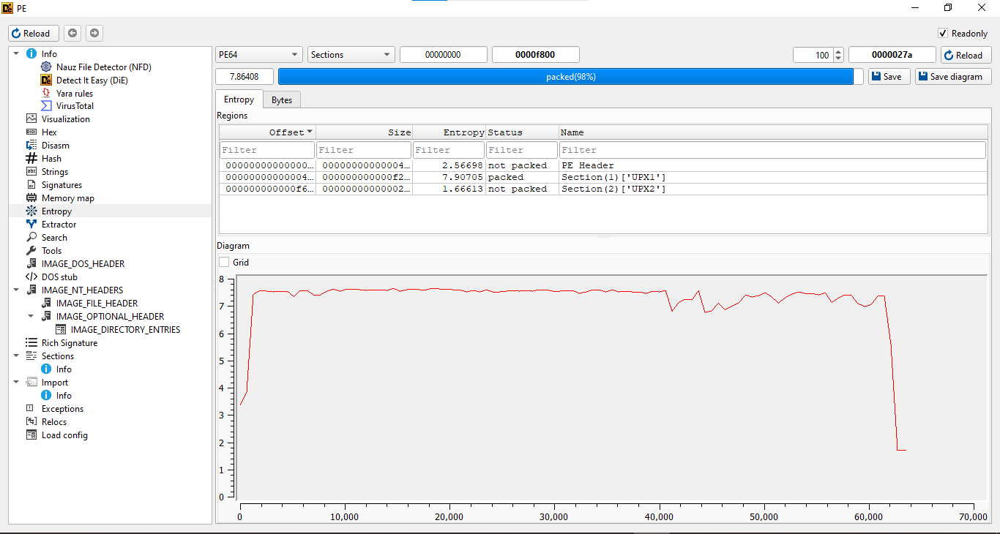
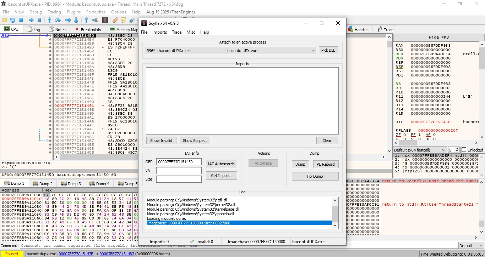
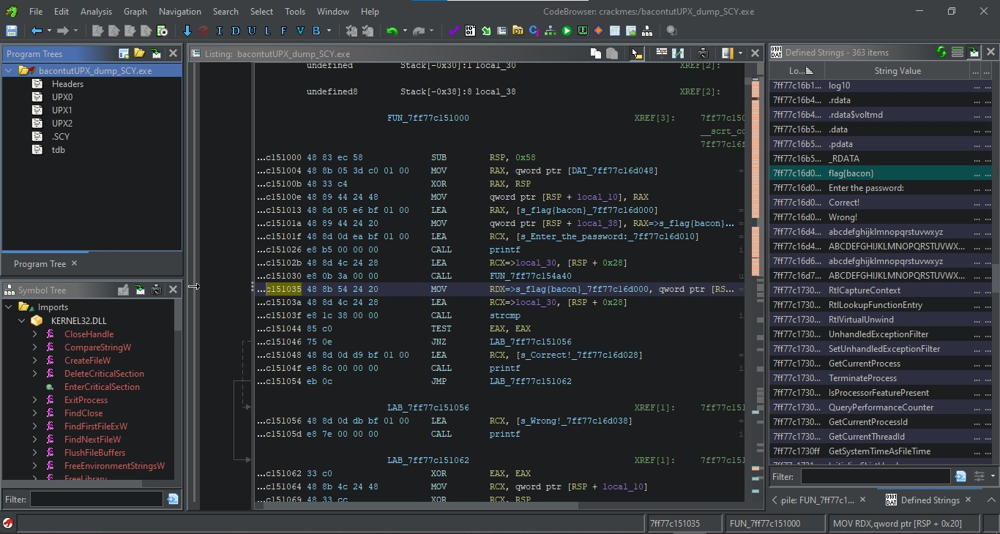

I recently created this blog in preparation for Flare-on 2025.  
To practice writing technical write-ups, I decided to create a tutorial on how to manually unpack UPX. In this tutorial, we’ll take a simple C program, pack it with UPX, and then manually unpack it using x64dbg, step by step.

So what is [UPX](https://github.com/upx/upx)?  
**UPX** stands for The **U**ltimate **P**acker for e**X**ecutables. It's a free and open-source executable packer that can typically reduce the size of programs and DLLs by **50%-70%**.
But what is a packer?  
Packers, also called runtime packers or self-extracting archives, are software that unpack themselves in memory when executed. This technique is sometimes referred to as executable compression, and it was originally invented to make files smaller so users wouldn’t have to unpack them manually.  
For more info, check out [Malwarebytes](https://www.malwarebytes.com/blog/news/malware/2017/03/explained-packer-crypter-and-protector).

Source Code:

```c
#include <stdio.h>
#include <string.h>

int main() 
{
    char input[32];
    const char *flag = "flag{bacon}";

    printf("Enter the password: ");
    gets(input);  
	
    if (strcmp(input, flag) == 0) {
        printf("Correct!\n");
    } else {
        printf("Wrong!\n");
    }

    return 0;
}
```


image test





