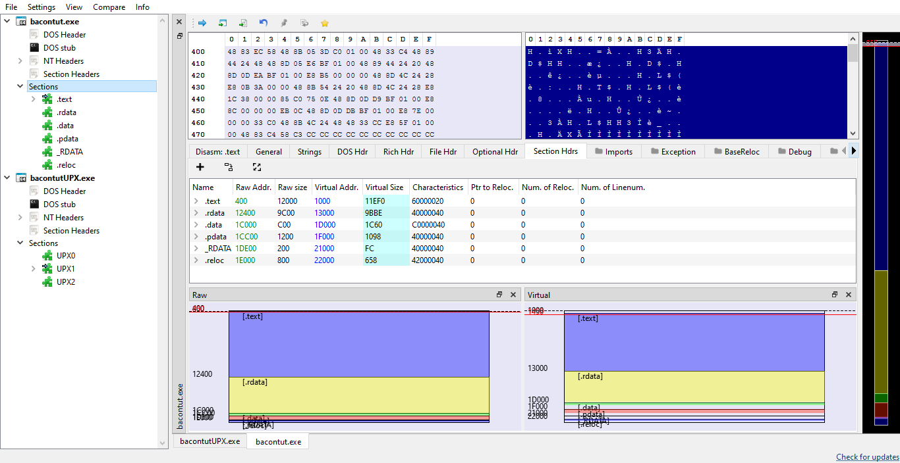
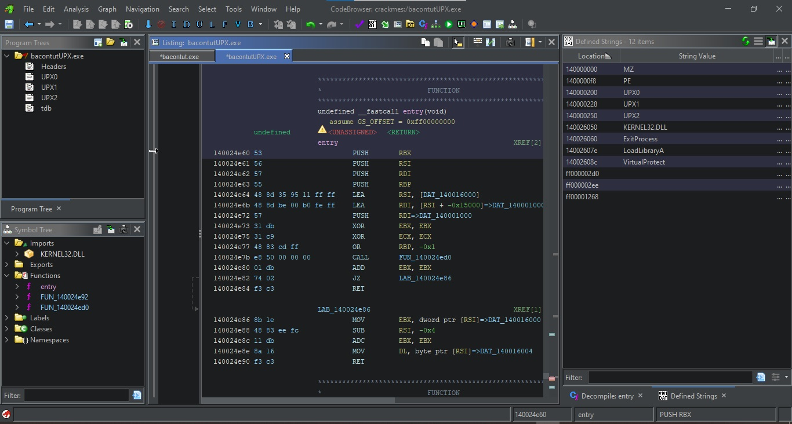
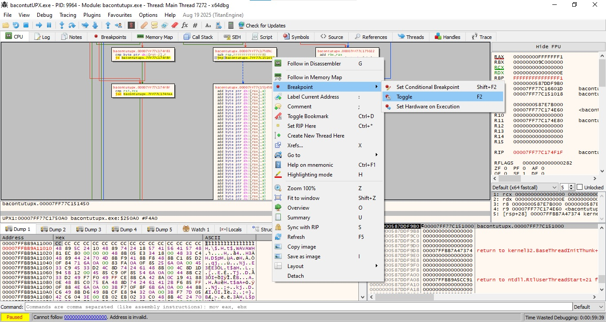
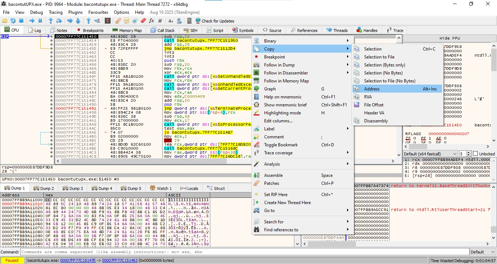

Source Code:

```c
#include <stdio.h>
#include <string.h>

int main() 
{
    char input[32];
    const char *flag = "flag{bacon}";

    printf("Enter the password: ");
    gets(input);  
	
    if (strcmp(input, flag) == 0) {
        printf("Correct!\n");
    } else {
        printf("Wrong!\n");
    }

    return 0;
}
```


image test












