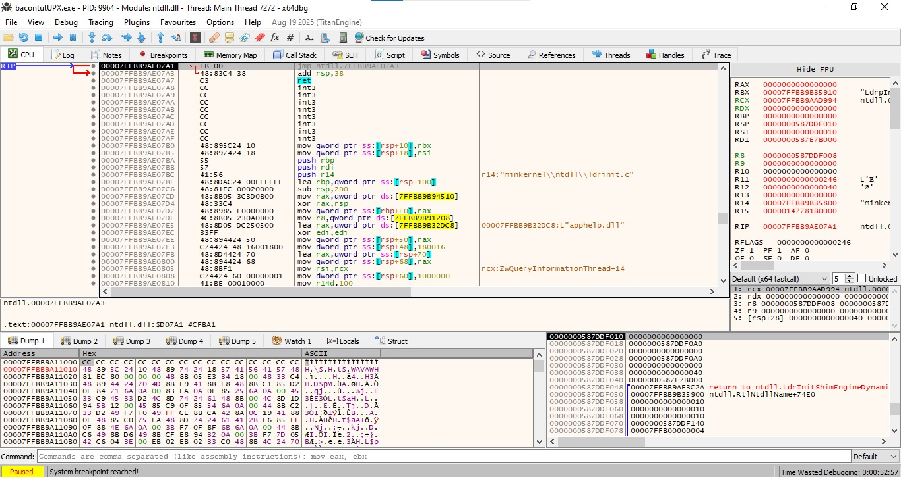
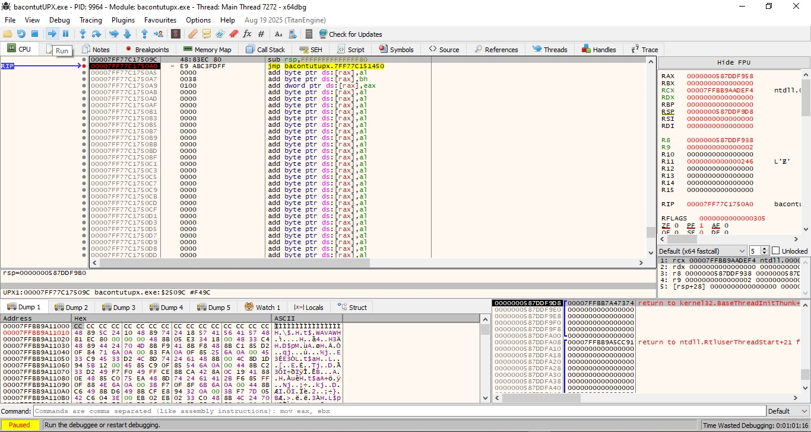

I recently created this blog in preparation for Flare-on 2025.  
To practice writing technical write-ups, I decided to create a tutorial on how to manually unpack UPX. In this tutorial, we’ll take a simple C program, pack it with UPX, and then manually unpack it using x64dbg, step by step.

So what is [UPX](https://github.com/upx/upx)?  
**UPX** stands for The **U**ltimate **P**acker for e**X**ecutables. It's a free and open-source executable packer that can typically reduce the size of programs and DLLs by **50%-70%**.

But what is a packer?  
Packers, also called runtime packers or self-extracting archives, are software that unpack themselves in memory when executed. This technique is sometimes referred to as executable compression, and it was originally invented to make files smaller so users wouldn’t have to unpack them manually.  
For more info, check out [Malwarebytes](https://www.malwarebytes.com/blog/news/malware/2017/03/explained-packer-crypter-and-protector).

So how do we manually unpack a binary?
In the simplest of terms, we will basically run the packed binary to let the unpacking stub unpack the binary for us and then dump the process to disk and manually fix the PE header. Usually this is done in three simple steps:
1. Find the OEP
2. Fix the IAT
3. Dump the binary from memory to disk

There are various methods of doing this but I will be using a fairly simple one that involves x64dbg and scylla.

##Setup##

#Tools#
x64dbg
ghidra
DIE
PEBear
#Creating a simple program
We'll start with a minimal C program that prompts the user for a password and compares it to a hardcoded string `flag{bacon}` This will be our test program for packing and unpacking.

Source Code:

```c
#include <stdio.h>
#include <string.h>

int main() 
{
    char input[32];
    const char *flag = "flag{bacon}";

    printf("Enter the password: ");
    gets(input);  
	
    if (strcmp(input, flag) == 0) {
        printf("Correct!\n");
    } else {
        printf("Wrong!\n");
    }

    return 0;
}
```
#Packing with UPX#
Next, after compiling the source above, we will pack the resulting binary with UPX.


##Step 1 How to tell if a binary is packed with UPX##
To determine if your binary is packed or not there are some indicators to look out for which will indicate that the binary is packed. The first of which is checking the binary's entropy.

Entropy is a measure of randomness and the higher the entropy the more random the data is, usually indicating that it is encoded or encrypted. The rule of thumb is that, if the entropy is 6.5 and above this is an indicator that the sample may be packed. 

For this step we will open the binary with DIE(Detect It Easy) and check the entropy

This first image is of the binary before we packed it with UPX. Notice the entropy is 6.13 which is below the 6.5 rule of thumb
##Unpacked##

This image below is of the binary after it was packed. Notice the entropy is 7.86 which is above the 6.5 rule of thumb

##Packed##


For this next step we open the binary in PEBear
Another easy to spot indicator is the sections. Notice the comparison of the unpacked(bacontut) and packed(bacontutUPX) binary below. the unpacked binary has normal section headers(.text, .rdata, .data, etc.) and the packed binary has the sections(UPX0, UPX1, UPX2)

##PEBear Comparison##








