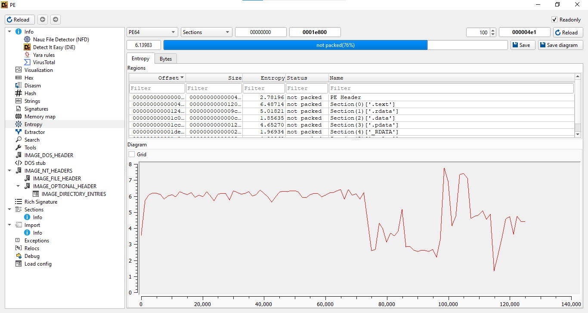
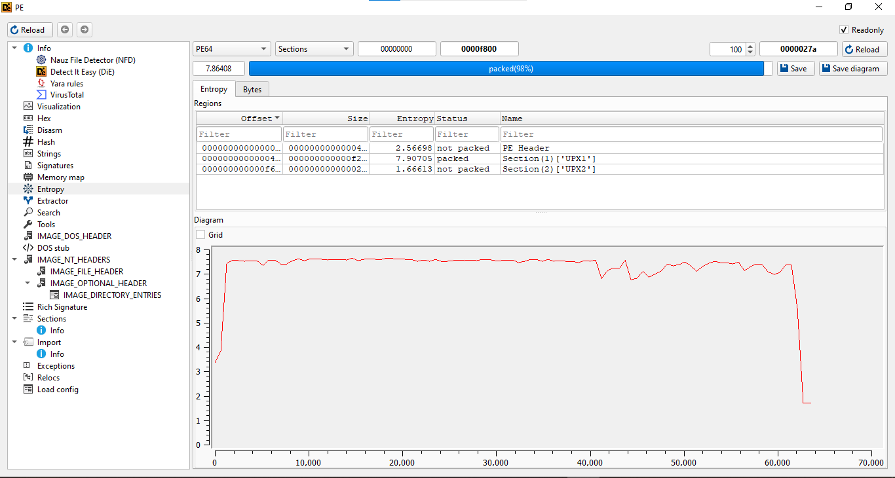
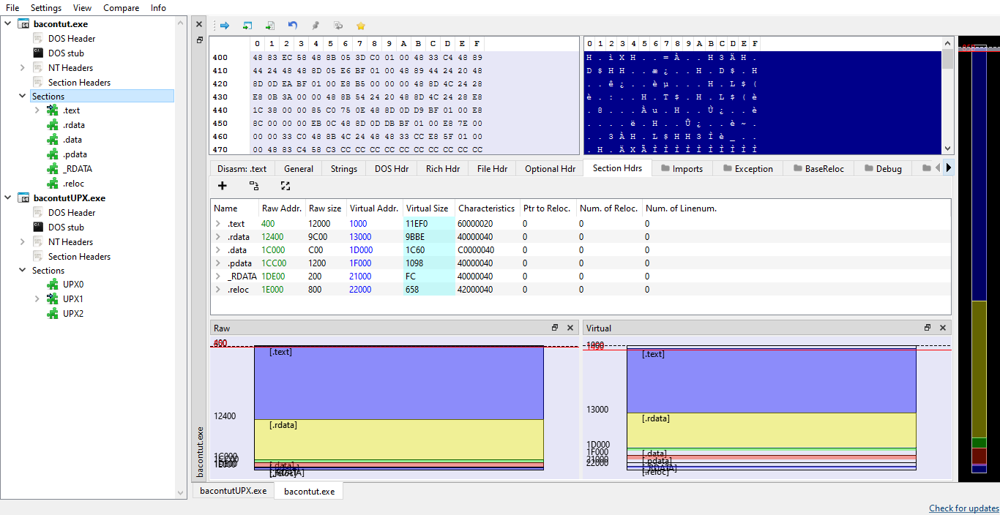
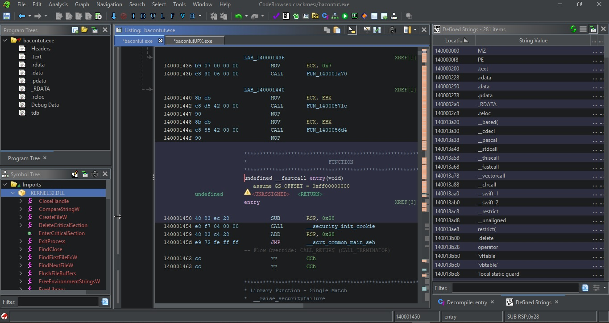
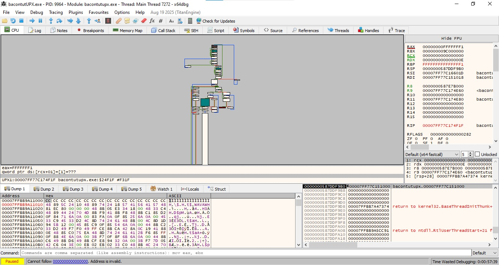
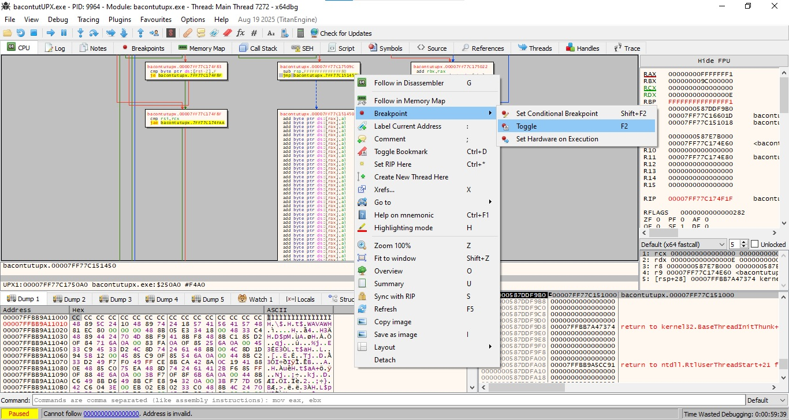
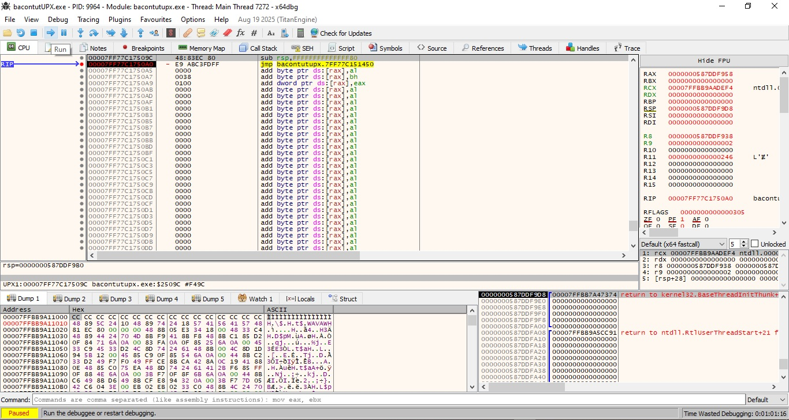
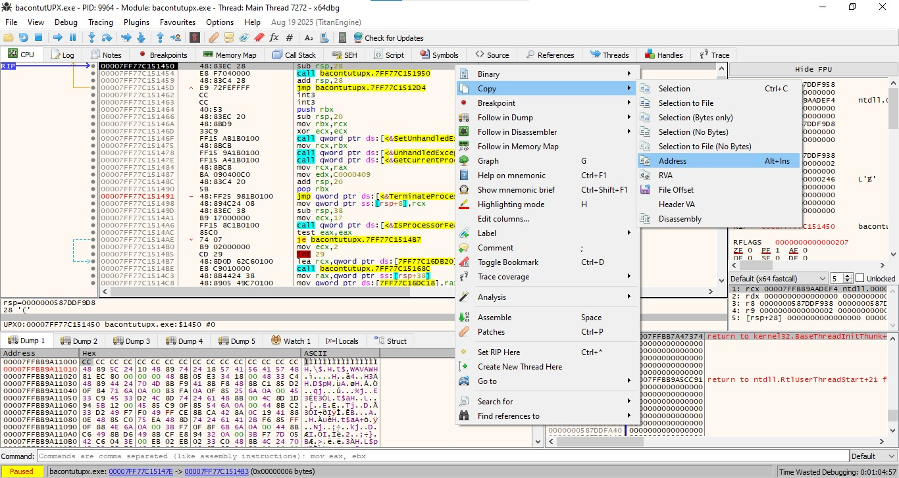
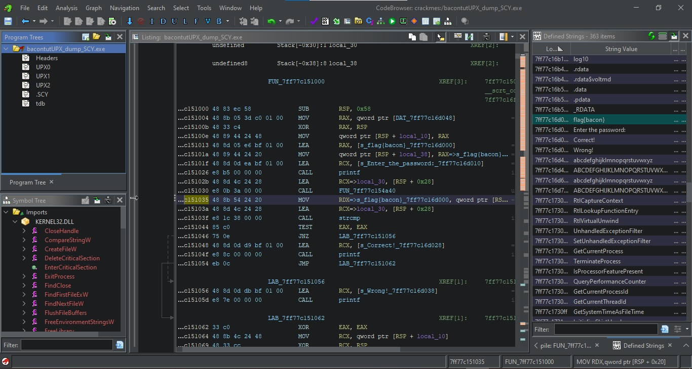

# Welcome to My Blog

Hey! I'm Bacon. This is my blog.
I’ll be posting updates here as I go.  

- **Day 37**: Created the blog on GitHub.  
- **Day 36**: Watched the [x64dbg dev stream](https://www.youtube.com/watch?v=eODAI3Z1dKc) , read *Practical Malware Analysis* (ch.18), and checked out various UPX unpacking tutorials. I was supposed to post my first tutorial today, but the topic turned out to be more complicated than I expected. A bit disappointed to have missed the goal, but that just means more to learn. Planning to read Flare-On writeups until I fall asleep.  
- **Day 35**: Finished the rough draft of the tutorial (below). Still need to figure out how to move it to a separate page without breaking the formatting. The tutorial itself needs a lot of formatting improvements, but I’m relieved it’s finished as it’s the end of Day 35, and I’ve already spent more time on this than I originally planned. I’ll keep reading Flare-On write-ups until I fall asleep. Tomorrow I’ll make a study plan
- **Day 34:** Worked a bit on the formatting today: bolded some sections and fixed the links. I’ll probably keep tweaking things little by little, experimenting with different ideas. Also played around with screenshots and figured out a few tricks that should save me time and make my workflow smoother. I’ve been browsing through a lot of other blogs, including some from friends, to see what I can adapt for mine. Really like the aesthetic of [HeapOverflow’s](https://revdiaries.com/), the professionalism of [Hasherezade’s](https://hshrzd.wordpress.com/), and the style of [Rick’s](https://0xrick.github.io/) -- hoping to pull a little inspiration from each. Didn’t get quite as much done as I’d hoped, but I kept up with reading Flare-On write-ups and added more notes for my study guide. Planning to wrap that up tomorrow.

More posts soon...

I recently created this blog in preparation for Flare-on 2025.  
To practice writing technical write-ups, I decided to create a tutorial on how to manually unpack UPX. In this tutorial, we’ll take a simple C program, pack it with UPX, and then manually unpack it using x64dbg, step by step.

So what is [UPX](https://github.com/upx/upx)?  
**UPX** stands for The **U**ltimate **P**acker for e**X**ecutables. It's a free and open-source executable packer that can typically reduce the size of programs and DLLs by **50%-70%**.

But what is a packer?

Packers, also called runtime packers or self-extracting archives, are software that unpack themselves in memory when executed. This technique is sometimes referred to as executable compression, and it was originally invented to make files smaller so users wouldn’t have to unpack them manually.  
For more info, check out [Malwarebytes](https://www.malwarebytes.com/blog/news/malware/2017/03/explained-packer-crypter-and-protector).

So how do we manually unpack a binary?

In the simplest of terms, we will basically run the packed binary to let the unpacking stub unpack the binary for us and then dump the process to disk and manually fix the PE header. Usually this is done in three simple steps:
1. Find the OEP
2. Fix the IAT
3. Dump the binary from memory to disk

There are various methods of doing this but I will be using a fairly simple one that involves x64dbg and scylla.

##**Setup**

**Tools**
- x64dbg
- Ghidra
- DIE
- PEBear

**Creating a simple program:**
We'll start with a minimal C program that prompts the user for a password and compares it to a hardcoded string `flag{bacon}` This will be our test program for packing and unpacking.

**Source Code:**

```c
#include <stdio.h>
#include <string.h>

int main() 
{
    char input[32];
    const char *flag = "flag{bacon}";

    printf("Enter the password: ");
    gets(input);  
	
    if (strcmp(input, flag) == 0) {
        printf("Correct!\n");
    } else {
        printf("Wrong!\n");
    }

    return 0;
}
```
**Packing with UPX:**
Next, after compiling the source above, we will pack the resulting binary with UPX.


###**Step 0 How to tell if a binary is packed with UPX:**
To determine if your binary is packed or not there are some indicators to look out for which will indicate that the binary is packed. The first of which is checking the binary's entropy.

Entropy is a measure of randomness and the higher the entropy the more random the data is, usually indicating that it is encoded or encrypted. The rule of thumb is that, if the entropy is 6.5 and above this is an indicator that the sample may be packed. 

For this step we will open the binary with DIE(Detect It Easy) and check the entropy

This first image is of the binary before we packed it with UPX. Notice the entropy is 6.13 which is below the 6.5 rule of thumb
**Unpacked**

This image below is of the binary after it was packed. Notice the entropy is 7.86 which is above the 6.5 rule of thumb

**Packed**


For this next step we open the binary in PEBear
Another easy to spot indicator is the sections. Notice the comparison of the unpacked(bacontut) and packed(bacontutUPX) binary below. the unpacked binary has normal section headers(.text, .rdata, .data, etc.) and the packed binary has the sections(UPX0, UPX1, UPX2)

**PEBear Comparison**


Other indicators to look out for in PEBear, which were not included in the screenshots, are high compression ratios, which often indicates that a packer has been used because the binary has been significantly reduced in size, and the differences between Raw Size and Virtual Size in the section headers.
**Raw Size** is how much space the section takes in the file on disk.
**Virtual Size** is how much memory it will occupy when loaded.
For packed binaries, the Raw Size of a compressed section like .UPX0 is much smaller than its Virtual Size because it will expand in memory once decompressed. In contrast, normal binaries have similar Raw and Virtual sizes as shown in the screenshot above.

Now for the other Idicators we will open the binary in Ghidra. Below is a screenshot of a unpacked binary(bacontut.exe) opened in Ghidra. Pay careful attention to the Imports on the left, the listing view in the middle and the Strings on the right.



Now compare the above image to the one below. Notice how there are very little Imports and Functions. Now if you look at the listing view you will see that it  looks like a bunch of junk and makes no sense. It was successfully packed and obfuscated though as we can tell by the upx1 text segment. Next look at the right and see how very little strings there are compared to the unpacked binary. 


After considering those indicators we can now determine whether or not the binary is packed and move on to step 1

####**Step 1 Find the OEP:**
Now we will open the packed binary in X64debug. Below is a simple screenshot of what it looks like when you open the binary in x64debug


Next we will need to look for the OEP. A simple way of doing this is pressing `g` to go into the graph view. What we are looking for is a jmp instruction before a giant block of code like the one below. If you do not see the giant code block just keep stepping and going back into graph view until you do. You will know it when you see it.


After finding the giant block of code we want to select the jump intruction before it and set a breakpoint.


Now we want to hit run and reach our breakpoint


After reaching our breakpoint next press step into and then copy the address of RIP. Congrats we have found the OEP

#####**Step 2 & 3**

Next, we open Scylla from the x64dbg toolbar. Once Scylla is open, paste the RIP address you copied from the breakpoint into the OEP field. This tells Scylla where the Original Entry Point of the unpacked binary is located.

Click “IAT Autosearch” to have Scylla locate the Import Address Table. Once Scylla finds the imports, press “Get imports”. Next press “Dump” to save the unpacked binary to disk. If the original file was named "bacontutUPX" the dump will be named "bacontutUPX_dump". Finally, use Scylla’s “Fix Dump” options to ensuring the dumped binary is runnable outside of the debugger. If the original file was named "bacontutUPX_dump" the dump will be named "bacontutUPX_dump_SCY". 


**Verify in Ghidra**

Open the dumped file (bacontutUPX_dump_SCY) in Ghidra. You should now see the following:
The Imports are restored.
The Functions are recognizable in the listing view.
All the Strings are present, including the hardcoded password (flag{bacon}). 


This confirms that the binary has been successfully unpacked and can now be analyzed normally. You can now run the binary to test that it behaves as expected or continue reverse engineering it further.

Optional notes for readers
Some binaries may require additional fixes after dumping, depending on how the packer works.
Always keep a backup of the original packed binary in case something goes wrong.
Scylla provides an easy interface for reconstructing both the IAT and PE header, which is crucial for creating a fully runnable unpacked file.

**Manually unpacking UPX resource list**


[Unpacking UPX in x64](https://medium.com/%407HPL/unpacking-upx-in-x64-d186b2d72c70)

[x64dbg Demo CrackMe Challenges](https://www.youtube.com/watch?v=fBPj5yEJgck&t=1675s)
  
[Working with UPX Manual Unpacking with IDA Pro, x32dbg and Scylla](https://www.youtube.com/watch?v=Npm5tuy1Pp4&t=14s)

[Unpacking UPX in a Debugger Under 1min](https://www.youtube.com/watch?v=guOcU-ZTL3A) 

[Manually unpacking a UPX packed binary](https://www.manrajbansal.com/post/manually-unpacking-a-upx-packed-binary) 

[hasherezade's 1001 nights: Tutorial: unpacking executables with TinyTracer + PE-sieve](https://hshrzd.wordpress.com/2025/03/22/unpacking-executables-with-tinytracer-pe-sieve/) 

[How to unpack UPX packed malware with a SINGLE breakpoint](https://infosecwriteups.com/how-to-unpack-upx-packed-malware-with-a-single-breakpoint-4d3a23e21332?gi=353dab816e00)

[PACKED BINARIES (And how to unpack them)](https://dplastico.github.io/sin%20categor%C3%ADa/2022/04/21/packed-binaries.html)

[Lab 8 - Anti-RE Techniques](https://cyberlab.pacific.edu/courses/comp272/labs/lab-8-anti-re)

